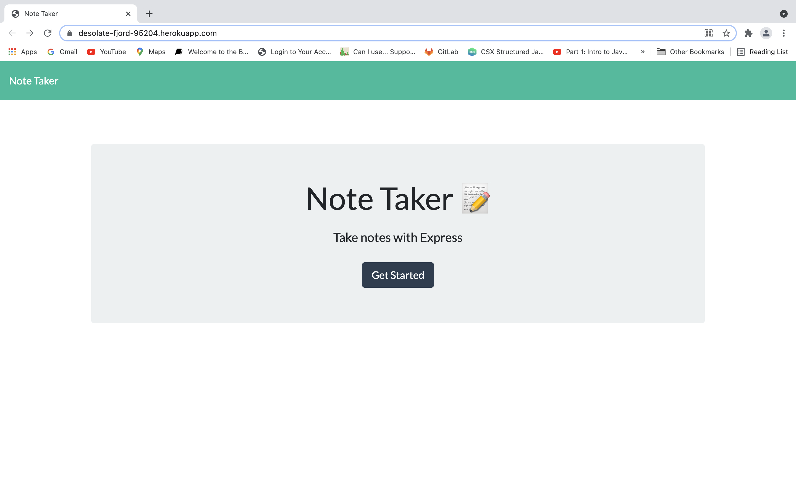
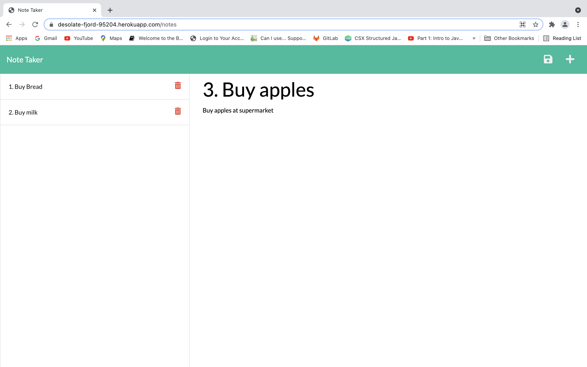

# note-taker
This app uses an Express.js to write and save notes

## Getting Started

* clone me, or fork me
* 🌎 live at: [heroku](https://note-taker-6068.herokuapp.com/)

* Screen shot of the deployed app: 
* 

## Deployment
* just deploy, no other actions needed

## Build With 

* [JavaScript](https://developer.mozilla.org/en-US/docs/Web/JavaScript)
* [db-json](https://www.npmjs.com/package/db-json)
  

## Acknowledgements
* **Billie Thompson** - *README template* - [PurpleBooth](https://github.com/PurpleBooth))